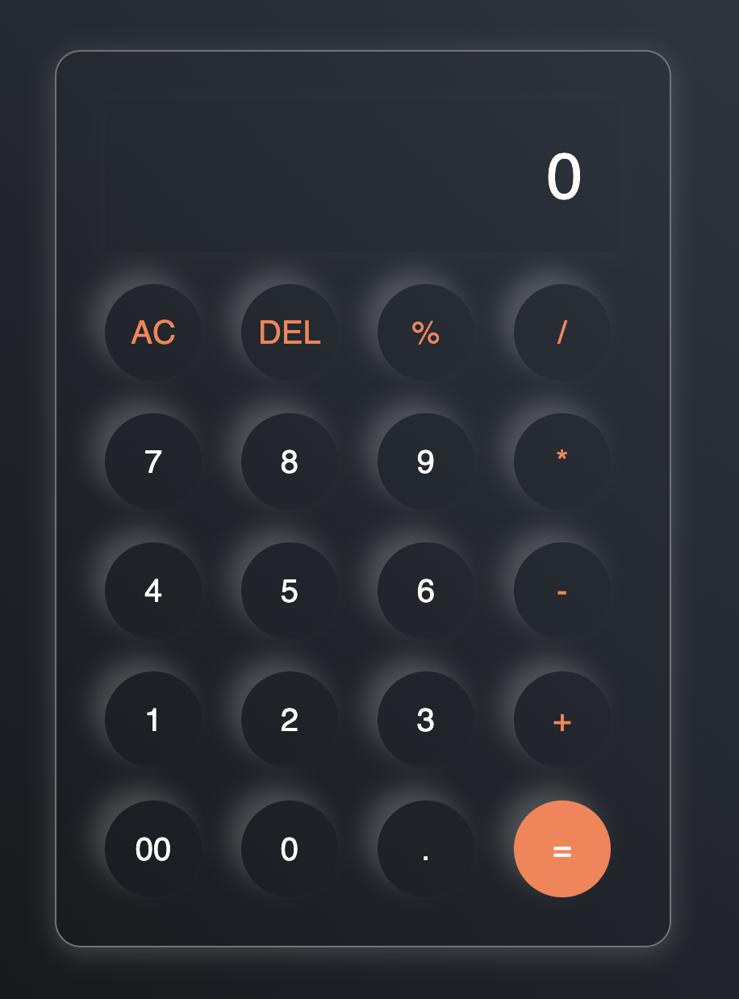

# Calculator App

This is a simple and intuitive calculator application built using HTML, CSS, and JavaScript. The calculator performs basic arithmetic operations like addition, subtraction, multiplication, and division. It features a clean user interface and responsive design, making it easy to use on both desktop and mobile devices.

## Features

- **Basic arithmetic operations:** Addition, subtraction, multiplication, and division.
- **Responsive design:** Seamlessly adapts to different screen sizes.
- **User-friendly interface:** Easy to navigate and use.
- **Real-time updates:** Instant results as you input calculations.

## Screenshot

Below is a screenshot of the Calculator App in action:

